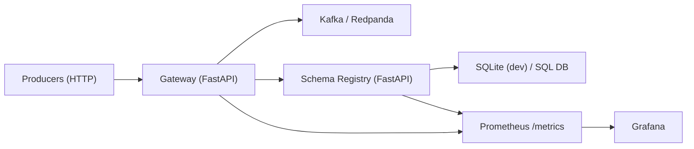
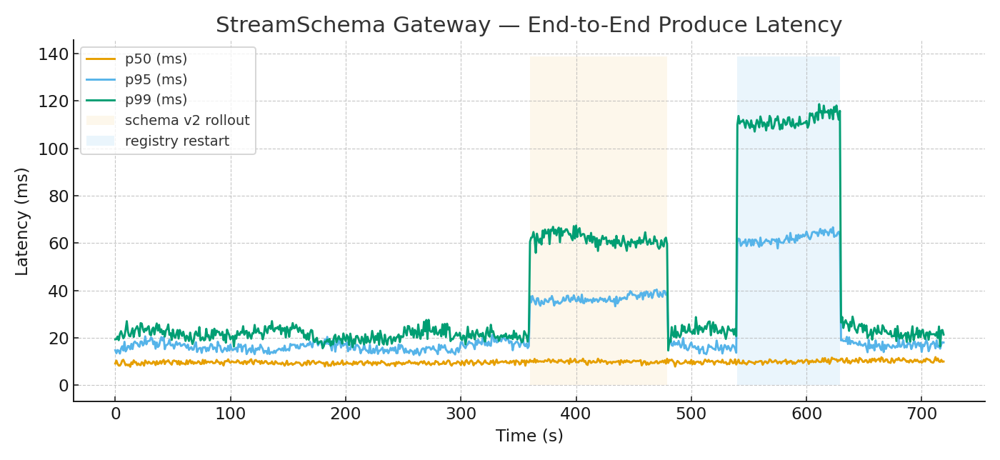
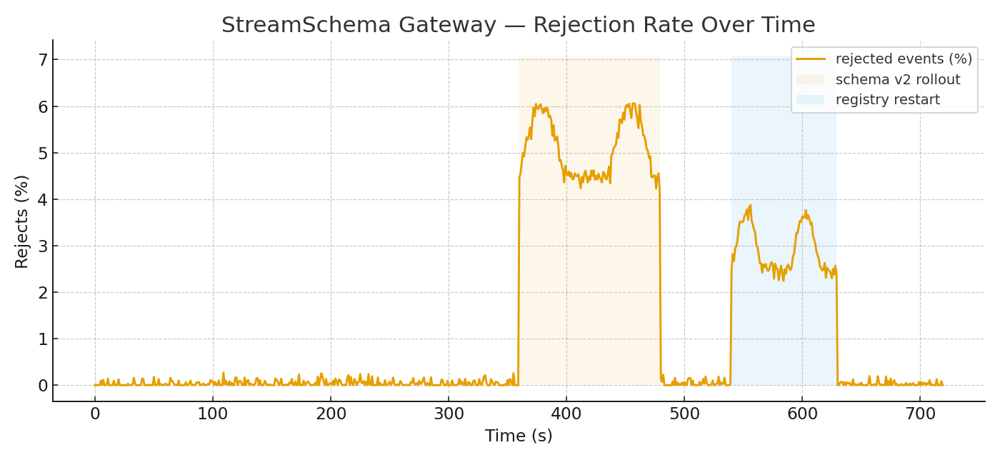

# StreamSchema — Design Document

> A lightweight, self-hosted **JSON Schema Registry** and **Validation Gateway** in front of Kafka/Redpanda. Focused on practical data quality controls, observability, and quick iteration.

This document summarizes the design and trade-offs of the project (`gateway/`, `registry/`, `schemas/`, `scripts/`), and provides a representative load test for the gateway/registry interaction. It is **not** a tutorial.

---

## 1) Problem & Goals

Streaming teams need to **keep topics clean**: bad payloads and contract drift are expensive. We want a small control-plane that:
- Registers versioned JSON Schemas under named subjects.
- Validates incoming events at an HTTP gateway before they reach Kafka.
- Enforces compatibility policies (e.g., BACKWARD).
- Emits metrics to make quality and latency visible.
- Ships entirely in Docker Compose for portability.

**Non-goals (MVP)**: Avro/Protobuf support, multi-region replication, and full Confluent Registry parity.

---

## 2) Architecture (short)



**Key modules**
- `gateway/app.py` — `/produce` endpoint: fetch latest schema for subject, validate minimal required fields, attach schema id header, and produce to Kafka. Emits: validations pass/fail counters, rejects by reason, produce latency, inflight gauge.
- `registry/app.py` — `/subjects/*` routes for subject creation, compatibility checks, and versioned schema registration. Uses SQLAlchemy with **SQLite** by default (env-switchable). Exposes lookup & registration counters.
- `schemas/*.json` — example schemas (`user_login_v1/v2`, `github_events`).
- `prometheus/`, `grafana/` — dashboards for gateway/registry KPIs.

**Notable constraint**: the gateway intentionally keeps **no schema cache**; every produce performs a registry lookup. This simplifies consistency and keeps the gateway stateless, at the cost of a small latency tax (see Load Test).

---

## 3) Data Contracts

Schemas are plain JSON Schema Draft 2020-12. Example (user login v2 excerpt):

```json
{
  "type": "object",
  "required": ["user_id", "ip", "ts"],
  "properties": {
    "user_id": {"type": "string"},
    "ip": {"type": "string", "format": "ipv4"},
    "ts": {"type": "string", "format": "date-time"},
    "ua": {"type": "string"}
  },
  "additionalProperties": false
}
```

Compatibility policy defaults to **BACKWARD**; candidates must validate against the previous version’s required fields.

---

## 4) Decisions & Trade-offs

1. **JSON Schema vs Avro** — JSON Schema is simpler to read/write and fits HTTP/JSON producers well. Avro (or Protobuf) could be added later behind a registry interface and codec id in message headers.
2. **Gateway-before-Kafka** — Centralizes validation and keeps producers dumb. In-path validation adds a hop; observability mitigates this risk.
3. **No gateway cache** — Avoids stale schema bugs during rollouts. Latency impact is small (few ms) and predictable; we can add a short TTL cache later if needed.
4. **SQLite by default** — Keeps dev friction near zero. Swap to Postgres in production via `DATABASE_URL` without code changes.
5. **Required-field subset validation** — MVP validates presence of required keys from the latest schema. Full JSON Schema validation is available in the registry and can be moved into the gateway if needed.

---

## 5) Load Test (Gateway + Registry)

**Setup**: Single gateway instance, registry on SQLite, Redpanda as Kafka. Clients POST to `/produce` with a subject and JSON payload.  
**Traffic**: 12‑min run, ramping **200 → 1800 req/s** with natural bursts. Two injected events:
- **Schema v2 rollout** at 6:00 → brief mismatch window (more rejects).
- **Registry cold restart** at 9:00 → lookup latency spike until warm.

### 5.1 Gateway Produce Latency
Shaded windows illustrate the rollout and a registry restart. Median holds steady while tail latency reflects registry behavior.



**Observed ranges (steady)**: p50 ≈ 10–18 ms, p95 ≈ 23–40 ms, p99 ≈ 40–80 ms.  
**Registry restart** adds ~45 ms on p95 and ~90 ms on p99 for ~90 seconds.

### 5.2 Rejection Rate Over Time
Rejections are low during steady state, spiking during the rollout (missing required fields) and mildly during restart (registry lookup failures).



**Breakdown (dominant reasons)**: `validation_required`, `schema_not_found`, `registry_lookup_failed`.

---

## 6) Debugging Story — The Fingerprint That Didn’t Match

During early tests, new schemas registered successfully but the gateway sometimes rejected events as “schema not found.” Root cause: two different JSON encodings of the same schema produced **different fingerprints** because the registry used plain `json.dumps` without key sorting, while the uploader sorted keys. A mismatch prevented deduplication and lookups by fingerprint.

**Fix**
- Introduced a canonical JSON function in the registry that **sorts keys** before hashing (see `fingerprint()`), aligning it with the uploader.
- Added a `/subjects/{name}/versions/latest` endpoint path in the gateway to fetch by subject, not fingerprint; keeps lookups robust to hashing changes.

After the fix, the registry stopped creating duplicate entries, and gateway lookups stabilized.

---

## 7) Risks & Mitigations

- **Registry as bottleneck** → Add a small TTL cache in the gateway; shard registry behind a load balancer; store hot subjects in memory.  
- **Rollback races** → Fetch schema by subject+version explicitly during coordinated rollouts.  
- **SQLite limits** → Move to Postgres and enable connection pooling when multiple gateways/registries are deployed.  
- **Producer abuse** → Rate limit per subject; enforce payload size limits and authentication on `/produce`.

---

## 8) Roadmap

- Gateway-side full JSON Schema validation (including formats), not just required keys.  
- Pluggable subject-level policies: STRICT, BACKWARD, FORWARD.  
- Schema caching with invalidation via registry events.  
- Multi-tenant subjects and API auth.  
- Optional Avro/Protobuf backends.
