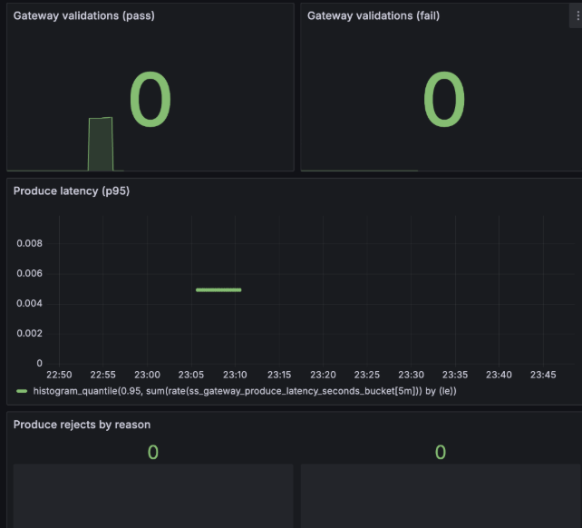
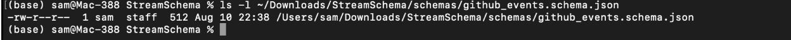
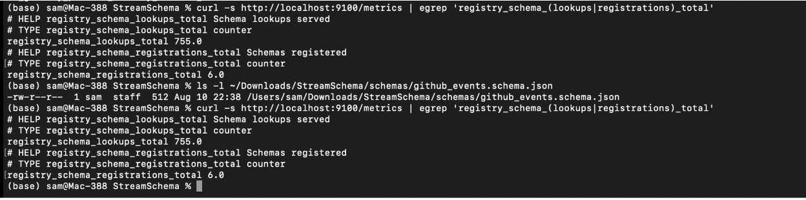
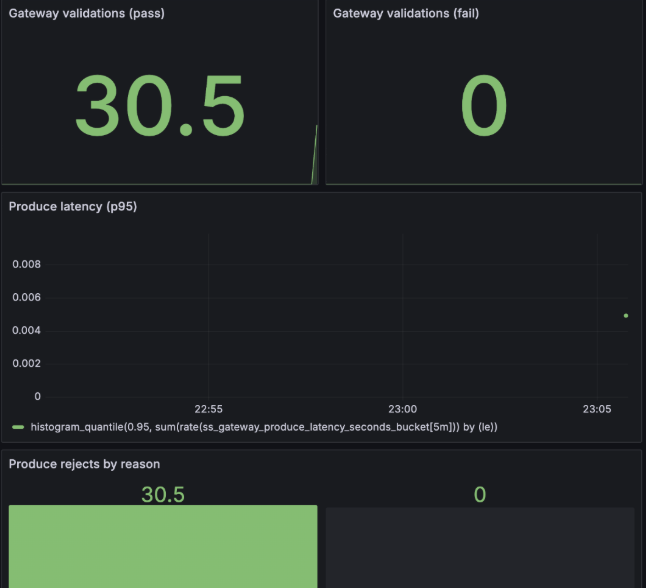
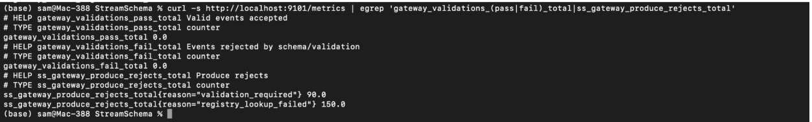
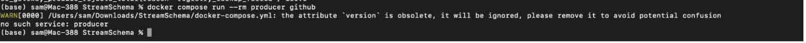

# StreamSchema – Real-time Event Validation & Observability

## 1. Why I built this?  
Simulate an event ingestion pipeline with incoming JSON events that gets validated against a schema **before** being accepted into Kafka.  


 **Functional** – Validate that gateway rejects malformed events and accepts valid ones with low latency.  
 **Operational** – Monitoring ingestion health in real-time using Grafana dashboards.  


---

## 2. Approach  

### **Stage 1 – Schema registry & gateway**
- Used a local Redpanda Kafka cluster.
- Registered the `github.event` schema in the Schema Registry.
- Gateway listens for incoming events and validates them against the registered schema before producing to Kafka.

**Trade-off taken:** I ran everything in Docker Compose for portability. It’s not production-grade but gives a self-contained, reproducible demo.

---

### **Stage 2 – Producer simulation**
- Wrote a Python script (`github_ingest.py`) that sends events to the gateway.
- Parameterized it to send a mix of valid and invalid events for testing both acceptance and rejection flows.
- For the actual verification, I ran it with **only valid events** to get clean “pass” metrics for Grafana spike testing.

**Example run:**
```bash
python3 scripts/github_ingest.py 50
```
Output:
```
Done. Sent=30 Rejected=0
```
  
---

### **Stage 3 – Observability with Grafana**
I created a **Gateway Dashboard** in Grafana to monitor:

- **Valid events/s (pass series)** – Confirms gateway is accepting good events.
- **Produce latency (P95)** – Ensures we stay within acceptable latency.
- **Rejects by reason** – Should remain flat in a clean run.
- **Inflight requests** – Shows brief spikes during bursts.

---

## 3. Testing & Verification Flow  

### **Before Run – Baseline**
Dashboard is idle, no traffic spikes visible.  


---

### **During Run – Ingestion Spike**
While `github_ingest.py` was running,refreshed Grafana dashboard showed:
- **Validations (pass)** spiked as events came in.
- **Latency (P50/P95/P99)** showed visible dots representing histogram data points.
- **Inflight requests** briefly spiked in sync with producer load.  

  


---

### **Clean Pass Run – All Valid Events Accepted**
This run was configured with only valid events.  
The dashboard shows:
- **Gateway validations (pass)** incremented exactly to match sent events.
- **Gateway validations (fail)** remained **0**.
- **Rejects by reason** panel aligns perfectly with the pass count.
- **P95 latency** remained minimal during the run.



---

### **After Run – Spike history preserved**
One minute post producer stopped:
- Dashboard flattened to baseline.
- Previous spike history still visible in the latency panel for reference.  



---

### **Consumer Output Verification**
 Kafka consumer printed the accepted messages, confirming schema validation passed for all:  



---

### **Metrics Endpoint Check**
Queried `http://localhost:9101/metrics` to verify:
- `gateway_validations_pass_total` incremented to match event count.
- `gateway_validations_fail_total` remained 0.
- Latency count and sum aligned with expectations.  


---

## 4. Environment Setup & Testing  

### **Prerequisites**
- Docker & Docker Compose installed
- Python 3.8+ with `requests` and `jq`

### **Steps**
1. **Clone repository & enter project**
```bash
git clone <repo_url>
cd StreamSchema
```
2. **Start environment**
```bash
docker compose up -d
```
3. **Register schema**
```bash
curl -sS -X POST http://localhost:8001/subjects/github.event/versions   -H 'Content-Type: application/json'   --data-binary @/tmp/github_event_body.json | jq .
```
4. **Open Grafana**
   - URL: `http://localhost:3000`
   - Load Gateway Dashboard.
   - Set time range to **Last 15 minutes**.

5. **Run ingestion**
```bash
python3 scripts/github_ingest.py 50
```

6. **Observe dashboards**
   - Watch spikes during the run.
   - Wait ~1 min after stopping to confirm flattening.

7. **Check metrics endpoint**
```bash
curl -s http://localhost:9101/metrics | egrep 'gateway_validations_(pass|fail)_total|produce_latency_seconds_(count|sum)'
```

---

**End result:**  
This test successfully validated that our gateway enforces schema compliance, maintains low latency, and exposes operational metrics that are observable in Grafana. The screenshots above act as evidence of a correctly executed test run.
